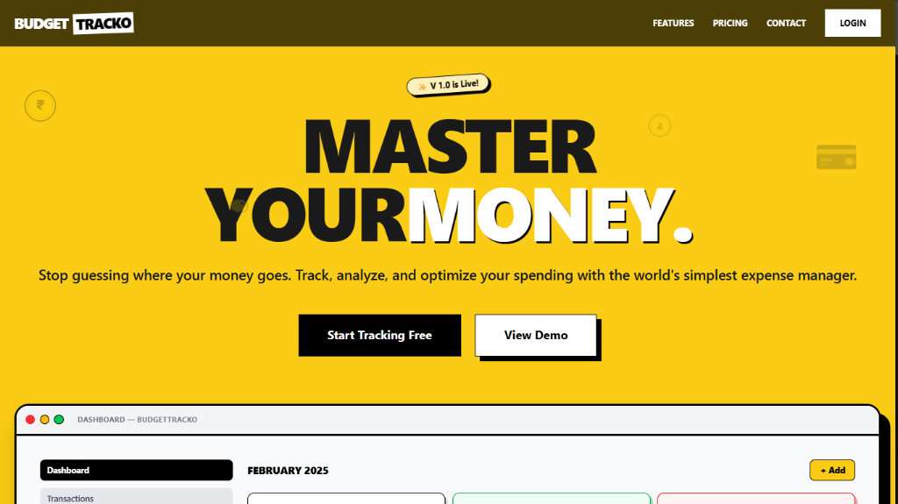
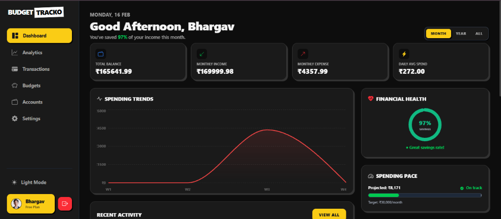
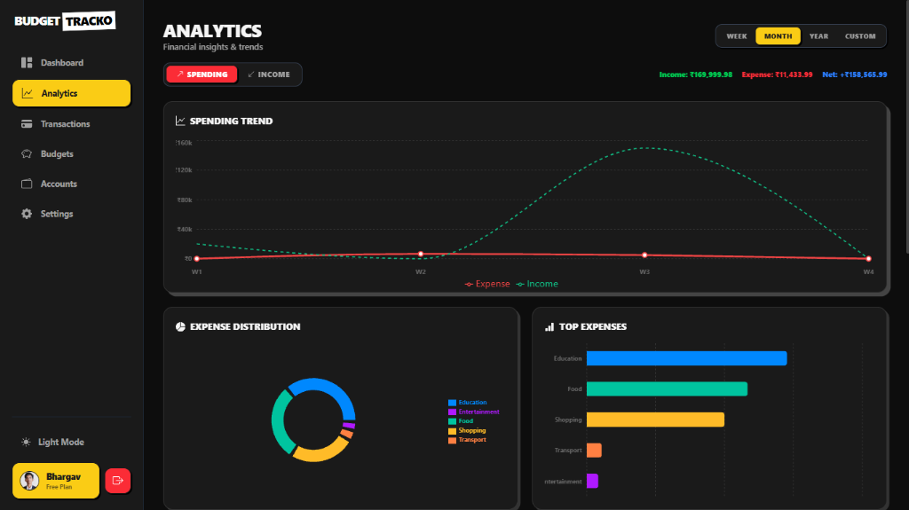
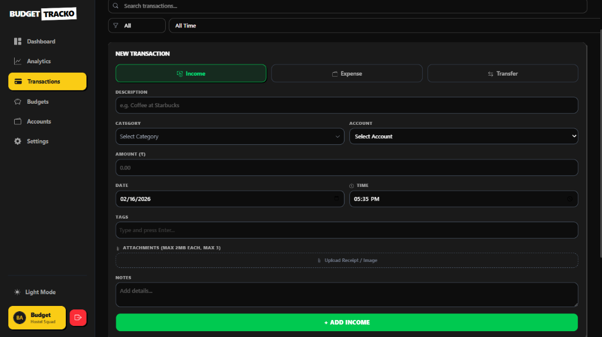
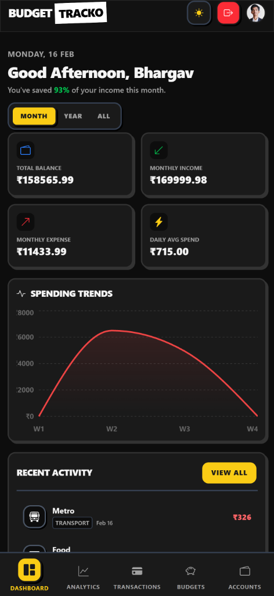
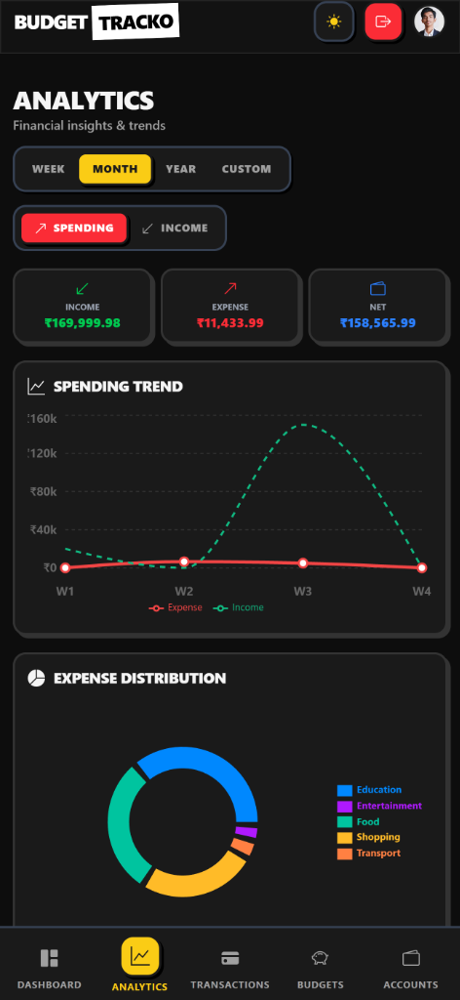
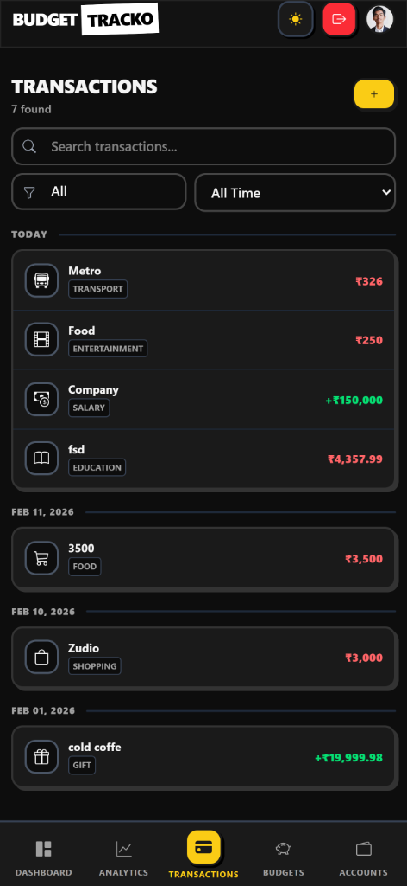

# BudgetTracko - Expense Manager



<div align="center">

[](https://opensource.org/licenses/ISC)
[](https://reactjs.org/)
[](https://nodejs.org/)
[](https://www.mongodb.com/)
[](https://tailwindcss.com/)

[**Visit Website**](https://www.budgettracko.app) • [**View Demo**](https://www.budgettracko.app/#demo) • [**Mobile App**](#mobile-app)

</div>

---

## 🚀 Master Your Money

**BudgetTracko** is a comprehensive personal finance manager designed for students and professionals. Stop guessing where your money goes. Track, analyze, and optimize your spending with the world's simplest expense manager.

> "I used to be broke by the 20th of every month. BudgetTracko helped me find where my money was leaking!" — *Priya S., MIT Pune*

---

## 📸 Screenshots

### Dashboard Overview

*Visualize your income, expenses, and balance in real-time.*

### Analytics & Reports

*Deep dive into your spending habits with beautiful charts. And effortless transaction management.*

### Easy Transaction Tracking


---

## ✨ Key Features

Everything you need to take full control of your finances.

*   **🌓 Dark & Light Mode**: Seamless theme switching for day or night usage.
*   **🏦 Multi-Account Support**: Track Cash, Bank Accounts, UPI, and Digital Wallets in one place.
*   **asd Advanced Analytics**: Interactive charts showing spending trends and category breakdowns.
*   **🔐 Secure Authentication**: Enterprise-grade OAuth 2.0 (Google/GitHub) and JWT protection.
*   **☁️ Cloud Sync**: Automatic cloud backup ensures you never lose your data.
*   **🚨 Budget Alerts**: Set limits and get notified before you overspend.
*   **🔄 Recurring Transactions**: Automate rent, subscriptions, and salary entries.
*   **📱 Mobile Friendly**: Fully responsive design for managing money on the go.
*   **👥 Multi-User Ready**: Share budgets with roommates or family members.

---

## 💰 Pricing Plans

Built for students & college life. Affordable plans that won't burn a hole in your pocket.

| Feature | **Starter 🎒** | **Campus Pro 🎓** | **Hostel Squad 🏠** |
| :--- | :---: | :---: | :---: |
| **Price** | **₹0 / forever** | **₹49 / month** | **₹99 / month** |
| **Transactions** | Up to 50/mo | **Unlimited** | **Unlimited** |
| **Accounts** | Single (Cash) | **Multi-Account** | **Multi-Account** |
| **Analytics** | Basic | **Advanced** | **Group Analytics** |
| **Users** | 1 User | 1 User | **Up to 5 Users** |
| **Exports** | - | CSV Export | PDF & CSV |
| **Support** | Community | Priority Email | Dedicated |

---

## 🛠️ Tech Stack

*   **Frontend**: React, Vite, Tailwind CSS, Framer Motion, Recharts
*   **Backend**: Node.js, Express, MongoDB, Mongoose, Passport.js
*   **Authentication**: Google OAuth, GitHub OAuth, JWT
*   **Payments**: Razorpay Integration
*   **Deployment**: Vercel (Frontend), Render/Railway (Backend)

---

## 📖 Documentation

*   [**Backend Guide**](./app/backend/README.md) - API endpoints, setup, and configuration.
*   [**Frontend Guide**](./app/frontend/README.md) - Component structure and UI details.

---

## 🏁 Getting Started

### Prerequisites
*   Node.js (v16+)
*   MongoDB (Local or Atlas URL)

### Quick Setup

1.  **Clone the repository**
    ```bash
    git clone https://github.com/BhargavK001/BudgetTracko-Expense-Manager.git
    cd BudgetTracko-Expense-Manager
    ```

2.  **Install Dependencies**
    ```bash
    # Backend
    cd app/backend && npm install
    # Frontend
    cd ../frontend && npm install
    ```

3.  **Configure Environment**
  *   Rename `.env.example` to `.env` in `app/backend`, `app/frontend`, and `app/mobile`.
    *   Add your MongoDB URI and API keys (see [Backend Docs](./app/backend/README.md)).
  *   In `app/mobile/.env`, set `EXPO_PUBLIC_API_URL` to your backend URL (use your local network IP for physical devices).

4.  **Run Locally**
    ```bash
    # Start Backend (Port 5000)
    cd app/backend && npm run dev
    
    # Start Frontend (Port 5173)
    cd app/frontend && npm run dev
    ```

---

## 📱 Mobile App

Take BudgetTracko with you! Our mobile app supports offline mode and instant sync.

<p align="center">
  
  
  
</p>

<div align="center">
  <a href="#">
    
  </a>
</div>

---

## 📄 License

This project is licensed under the **ISC License**.

See [CHANGELOG.md](./CHANGELOG.md) for release history.

---

<div align="center">
  <p>Made with ❤️ by Bhargav Karande</p>
</div>
